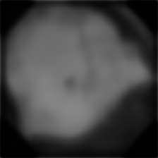
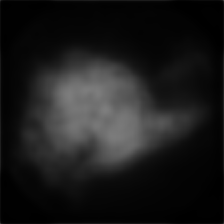

# WCEClassifyViStA
WCE Classification with Visual Understanding through Segmentation and Attention

Our WCE image classification network is named as “**WCE ClassifyViStA (WCE Classification with Visual understanding through Segmentation and Attention)**”. A block schematic of ClassifyViStA is shown below. It has a standard classification path and two other branches viz. implicit attention branch and the segmentation branch. 

In the implicit attention branch, the feature maps from the encoder are weighted by the given groundtruth segmentation masks and then sent to the classification head. This ensures that, for bleeding class, the network focuses on the region of bleeding rather than the whole image. 

In the segmentation branch, the output from the encoder goes through a U-net style decoder and constructs the segmentation mask. 

Both these branches supplement the standard path of classification implicitly with the region of interest in case of bleeding images. For non-bleeding images, the attention branch focuses on the whole feature map while the segmentation branch constructs a zero-filled segmentation map. 

While inferencing, attention branch is not used since segmentation masks will not be available during inference. Class predictions are obtained using the standard classification path and explanations are derived from the predicted segmentation masks. Like doctors look for bleeding spots to classify a WCE image into bleeding class, the predicted segmentation masks identify bleeding regions with bright pixels and non-bleeding regions with dark pixels, attempting to mimic what the doctor does. This is the most natural way of explaining the class prediction for a WCE image. So, we have come with our own explainabilty for explaining the class predictions instead of relying on LIME, SHAP etc. 

To improve classification performance, we have used an ensemble of two models in our ClassifyViStA viz. Resnet18 and VGG16. The final classification is based average prediction probabilities from both the models.

**Detection Network (SoftNMS activated YOLOV8)**

For WCE bleeding region detection, we have used YOLOV8. However, instead of using YOLOV8 as it is, we activated soft non-max suppression (Soft NMS) during inferencing  instead of standard NMS, which provides a softer and more nuanced handling of overlapping boxes, reducing the risk of removing partially correct boxes. We found soft NMS to do better than standard NMS in our validation set. 

## Data Organization
Data should be organized as follows for training the classifier:

## Training & Inferencing
### Classification
To train the classification model, execute:

	python WCE_classification.py --root_dir path-to-directory-where-datasets-folder-is-present/WCEBleedGen --batch_size 32 --epochs 100 --save_dir path-to-directory-to-save-the-trained-model
 
To infer from the trained classification model, execute:

	python inference.py --model_path path-to-pretrained-pytorch-model-file --test_dir path-to-directory-of-test-images
 
Note: 
# (i) 
We have placed our pretrained model named _ClassifyViStA_model.pt_ in ..............
          
# (ii)
For predicting classes for Test Dataset 1, we first removed the superimposed white boundary on the images using connected component analysis, morphological post processing and inpainting. These preprocessed images are considered for classification. The tabulated classification results below on test dataset 1 is based on this preprocessing. The code to do this preprocessing is available in _utils_ folder as _rm_bndry.py_. Inside the code, correctly set the source and the target directories, in case you want to use it.

## Detection
For training, we used pretrained YOLOV8 medium (m) model (on COCO dataset) with confidence threshold set to 0.25 and IoU threshold set to 0.4. For details, you can refer to 

https://github.com/ultralytics/ultralytics

For inference, you can execute:

	python detect_bleeding.py --source path-to-directory-of-test-images --device device-number-if-gpu-available
 
Note: 
# (i) 
By default, the code will run on cpu. So, if no gpu is available, no need to specify any device. The results (both, images with bounding boxes superimposed on it and the bounding boxes, are created in _./results/images_ and _./results/labels_, respectively).
# (ii)
Inside the _detect_bleeding.py_, opt.model is to the pretrained yolov8 medium model (available as _detect_best.pt_ in .........) on the WCE bleeding trainset. If you want to provide another yolov8 medium model, you have to change this line in the code.
# (iii) 
As already mentioned, we activated the soft nms, also called merged nms in the yolov8. By default, it is not activated. To activate, set _merge_ to _True_ in line 191 in _./ultralytics/yolo/utils/ops.py_.

**A set of tables of the achieved evaluation metrics (for 80:20 train:valid split)**

Train-valid split was obtained using 
*sklearn.model\_selection.train\_test\_split* with *random\_state* argument set to 42 for reproducibility.

**Table 1: Classification Performance on Validation Set**

|**S.No.**|**Metric**|**Value**|
| :- | :- | :- |
|1|Accuracy|0\.9962|
|2|Precision|0\.9962|
|3|Recall|0\.9962|
|4|F1-Score|0\.9962|

**Table 2: Detection Performance on Validation Set**

|**S.No.**|**Metric**|**Value**|
| :- | :- | :- |
|1|Average Precision|0\.7715|
|2|MAP@0.5|0\.726|
|3|MAP@0.5-0.95|0\.483|
|4|Average IoU|0\.6405|

**Table 3: Pictures of any 10 best images selected from the validation dataset showing its classification and detection**

While there are many images from the validation set with high confidence and high IoU detection, we have chosen 10 images varying in illumination, region (inside the stomach), texture etc. and that which covers bounding boxes with small, large and medium areas that overlap significantly with the corresponding groundtruth. The groundtruth detection is also shown in the table below for easy comparison.

|S.No.|Image Name|Groundtruth image with ground truth bbox|Predicted bbox with confidence|Classification + Confidence|
| :- | :- | :- | :- | :- |
|1|bleeding/img- (276).png|{width="1.58in"height="1.58in"}|{width="1.58in"height="1.58in"}|
Predicted: Bleeding

Confidence: 1.0
|
|2|bleeding/img- (320).png|{width="1.58in"height="1.58in"}|{width="1.58in"height="1.58in"}|
Predicted: Bleeding

Confidence: 1.0
|
|3|bleeding/img- (473).png|{width="1.58in"height="1.58in"}|{width="1.58in"height="1.58in"}|
Predicted: Bleeding

Confidence: 1.0
|
|4|bleeding/img- (581).png|{width="1.58in"height="1.58in"}|{width="1.58in"height="1.58in"}|
Predicted: Bleeding

Confidence: 0.9998
|
|5|bleeding/img- (654).png|{width="1.58in"height="1.58in"}|{width="1.58in"height="1.58in"}|
Predicted: Bleeding

Confidence: 0.9998
|
|6|bleeding/img- (697).png|{width="1.58in"height="1.58in"}|{width="1.58in"height="1.58in"}|
Predicted: Bleeding

Confidence: 0.9994
|
|7|bleeding/img- (775).png|{width="1.58in"height="1.58in"}|{width="1.58in"height="1.58in"}|
Predicted: Bleeding

Confidence: 0.9982
|
|8|bleeding/img- (894).png|{width="1.58in"height="1.58in"}|{width="1.58in"height="1.58in"}|
Predicted: Bleeding

Confidence: 0.9997
|
|9|bleeding/img- (968).png|{width="1.58in"height="1.58in"}|{width="1.58in"height="1.58in"}|
Predicted: Bleeding

Confidence: 0.9994
|
|10|bleeding/img- (1120).png|{width="1.58in"height="1.58in"}|{width="1.58in"height="1.58in"}|
Predicted: Bleeding

Confidence: 1.0
|

**Table 4: Pictures of the achieved interpretability plot of any 10 best images selected from the validation dataset**

Our team intends to explain the classification using the predicted segmentation mask. In fact, a doctor would classify a WCE image as bleeding by looking for bleeding spots in the image. So, enabling the machine to attempt to mimic what doctor does is, we believe, the more natural way of explaining the reason for classification. Towards this end, we had added a parallel branch to the classifier network which decodes the features from the classifier backbone (in the style of U-net decoder) and predicts a segmentation mask. Below, we show the predicted segmentation masks where the brighter corresponds to area where possible
bleeding is present in the original WCE image. The corresponding groundtruth image with the inlaid bounding box is shown for easy
comparison. For sake of consistency, we are choosing the same 10 images that was chosen for the above table (Table 3), even though there are many other images for which the segmentation mask is more accurate (segmentation mask for all the 263 positive class validation images can be generated using the steps mentioned above for inferring from the classification model). Even for the chosen 10 images, except for a couple of images, the masks that explain the classification are quite accurate.

|S.No.|Image Name|Groundtruth image with ground truth bbox|Predicted segmentation mask for explainability |
| :- | :- | :- | :- |
|1|bleeding/img- (276).png|||
|2|bleeding/img- (320).png|||
|3|bleeding/img- (473).png|||
|4|bleeding/img- (581).png|||
|5|bleeding/img- (654).png|||
|6|bleeding/img- (697).png|||
|7|bleeding/img- (775).png|||
|8|bleeding/img- (894).png|||
|9|bleeding/img- (968).png|||
|10|bleeding/img- (1120).png|||

**Table 5: Pictures of any 5 best images selected from the test dataset 1 showing its classification and detection**

|S.No.|Image Name|Predicted bbox with confidence|Classification + Confidence|
| :- | :- | :- | :- |
|1|A0031||
Predicted: Bleeding

Confidence: 0.9906
|
|2|AOO36||
Predicted: Bleeding

Confidence: 1.0
|
|3|A0038||
Predicted: Bleeding

Confidence: 1.0
|
|4|A0042||
Predicted: Bleeding

Confidence: 0.9997
|
|5|A0046||
Predicted: Bleeding

Confidence: 0.9483
|

**Table 6: Pictures of any 5 best images selected from the test dataset 2 showing its classification and detection**

|S.No.|Image Name|Predicted bbox with confidence|Classification + Confidence|
| :- | :- | :- | :- |
|1|A0401||
Predicted: Bleeding

Confidence: 0.5949
|
|2|A0405||
Predicted: Bleeding

Confidence: 0.9808
|
|3|A0420||
Predicted: Bleeding

Confidence: 1.0
|
|4|A0467||
Predicted: Bleeding

Confidence: 0.9933
|
|5|A0497||
Predicted: Bleeding

Confidence: 0.9469
|

**Table 7: Pictures of the achieved interpretability plot of any 5 best images selected from the test dataset 1**

|S.No.|Image Name|Groundtruth image |
Predicted segmentation mask for explainability 

|
| :- | :- | :- | :- |
|1|A0031|||
|2|A0036|||
|3|A0038|||
|4|A0042|||
|5|A0046|||

**Table 8: Pictures of the achieved interpretability plot of any 5 best images selected from the test dataset 2**

|S.No.|Image Name|Groundtruth image |
Predicted segmentation mask for explainability 

|
| :- | :- | :- | :- |
|1|A0401|||
|2|A0405|||
|3|A0420|||
|4|A0467|||
|5|A0497|||

# Observations:
## 1.
Towards the end, we realized that for different validation sets, different accuracies (some much better than what we are quoting here are obtained). We had fixed _random_state_ to _42_ right from the beginning for reproducability and we did not want to change at the last minute. It would have been better if a fixed/hold-out validation set was provided.
## 2.
It would have been better if the test dataset 1 images had been provided without the superimposed boundary. The boundary could have been provided in the form of segmentation masks separately. We had to preprocess the test dataset 1 to get good performance.

